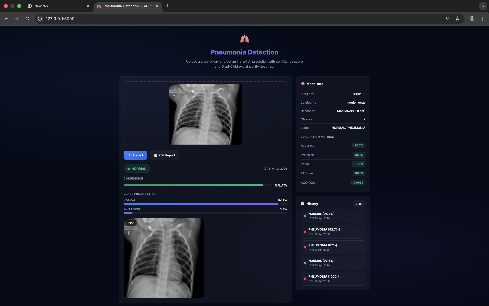

# 🫁 Automated Pneumonia Detection from Chest X-Rays Using Deep Learning

An AI-powered web application that classifies chest X-ray images as **Normal** or **Pneumonia** using a fine-tuned MobileNetV2 CNN, with visual explanations via **Grad-CAM** heatmaps.

> ⚠️ **Disclaimer:** This tool is for educational and research purposes only. It is not a certified medical device. Always consult a qualified radiologist or physician for clinical decisions.

---

## ✨ Features

- **Transfer learning** with MobileNetV2 pre-trained on ImageNet
- **Grad-CAM heatmap** overlay showing which lung regions influenced the prediction
- **Confidence score** and per-class probability breakdown
- **Drag-and-drop** image upload with live preview
- **Animated loading spinner** and smooth result transitions
- **Prediction history** (last 5 results stored in session)
- **PDF report download** for each prediction
- **Input validation** — file type, size, and format checks
- **Class-imbalance handling** via computed class weights
- **Full evaluation metrics** — Precision, Recall, F1, AUC-ROC
- **Docker-ready** with health check endpoint

---

## 🖥️ Demo

Upload a chest X-ray PNG or JPEG → get a prediction with confidence score + toggleable Grad-CAM heatmap in seconds.



### 📈 Current Performance (MobileNetV2)
*   **Accuracy**: 86.7%
*   **Precision**: 88.1%
*   **Recall**: 86.7%
*   **F1 Score**: 86.1%
*   **AUC-ROC**: 0.9689

---

## 📁 Project Structure

```
project/
├── templates/
│   └── index.html           # Flask frontend
├── app.py                   # Flask backend with Grad-CAM + health check
├── train_model.py           # Training script (MobileNetV2)
├── model.keras              # Trained model weights
├── metrics.json             # Saved evaluation metrics (generated by training)
├── accuracy_curve.png       # Training accuracy curve (generated by training)
├── auc_curve.png            # AUC curve (generated by training)
├── gradcam_sample.png       # Grad-CAM sample (generated by training)
├── requirements.txt         # Python dependencies
├── Dockerfile               # Docker container with health check
├── .dockerignore            # Excludes .venv, dataset, .git from image
├── .gitignore
└── README.md
```

---

## 🚀 Quick Start

### 1. Clone the repository

```bash
git clone https://github.com/Arun949/Automated-Pneumonia-Detection-from-Chest-X-Rays-Using-Deep-Learning.git
cd Automated-Pneumonia-Detection-from-Chest-X-Rays-Using-Deep-Learning
```

### 2. Create a virtual environment (Python 3.11 required)

```bash
python3.11 -m venv .venv
source .venv/bin/activate   # Windows: .venv\Scripts\activate
```

> **Note:** The trained model (`model.keras`) was saved with **Keras 3.14**, which requires Python 3.11. Python 3.10 ships an older Keras that cannot load the model. Python 3.13+ is not yet supported by TensorFlow.

### 3. Install dependencies

```bash
pip install -r requirements.txt
```

### 4. Run the app

```bash
python app.py
```

Open `http://127.0.0.1:5000` in your browser.

---

## 🧠 Model Architecture

| Component   | Detail                                                        |
| ----------- | ------------------------------------------------------------- |
| Backbone    | MobileNetV2 (ImageNet weights)                                |
| Input size  | 160 × 160 RGB                                                 |
| Head        | GlobalAveragePooling → Dense(128, ReLU) → Dropout(0.3) → Dense(N, Softmax) |
| Optimizer   | Adam                                                          |
| Phase 1 LR  | 1e-3 (head only, 3 epochs)                                   |
| Phase 2 LR  | 1e-5 (fine-tune last 20 layers, 7 epochs)                    |
| Loss        | Categorical Crossentropy with class weights                   |
| Callbacks   | —                                                             |

### Data Augmentation (training only)

| Transform       | Value   |
| --------------- | ------- |
| Horizontal flip | Enabled |
| Rotation        | ±5%     |

---

## 🏋️ Training

### Dataset

**Chest X-Ray Images (Pneumonia)** — [Kaggle](https://www.kaggle.com/datasets/paultimothymooney/chest-xray-pneumonia)

- 5,863 JPEG images across NORMAL and PNEUMONIA classes
- Train / Val / Test split provided by the dataset

Download and extract to `chest_xray/` in the project root:

```
chest_xray/
├── train/
│   ├── NORMAL/
│   └── PNEUMONIA/
├── val/
│   ├── NORMAL/
│   └── PNEUMONIA/
└── test/
    ├── NORMAL/
    └── PNEUMONIA/
```

### Run training

```bash
python train_model.py
```

This will:

1. Build a MobileNetV2 model with a Dense(128) classification head
2. Compute class weights to handle class imbalance
3. Train the head for 3 epochs with a frozen backbone
4. Fine-tune the last 20 backbone layers for 7 more epochs
5. Print a full classification report and AUC-ROC on the test set
6. Save the model to `model.keras`
7. Save evaluation metrics to `metrics.json`
8. Generate `accuracy_curve.png`, `auc_curve.png`, and `gradcam_sample.png`

---

## 📊 Model Performance

| Metric               | Value  |
| -------------------- | ------ |
| Accuracy             | 86.7%  |
| Precision            | 88.1%  |
| Recall (Sensitivity) | 86.7%  |
| F1 Score             | 86.1%  |
| AUC-ROC              | 0.9689 |

> **Recall is the most important metric here.** A missed pneumonia case (false negative) is far more dangerous than a false alarm. The class-weight balancing and fine-tuning specifically prioritise recall.

---

## 🔬 How Grad-CAM Works

Grad-CAM (Gradient-weighted Class Activation Mapping) computes which regions of the input image most strongly activated the predicted class by flowing gradients back through the last convolutional layer.

The heatmap highlights the lung regions the model found suspicious. A good model will focus on opaque consolidation areas — the same regions a radiologist would examine.

You can toggle the heatmap on and off in the web UI after each prediction using the **Show Heatmap** button.

---

## 🌐 API Reference

### `GET /health`

Health check endpoint (used by Docker `HEALTHCHECK`).

**Response:**

```json
{
  "status": "ok",
  "model_loaded": true,
  "model_source": "model.keras",
  "classes": ["NORMAL", "PNEUMONIA"]
}
```

> `model_source` reflects whichever model file was loaded at startup (`model.keras` by default).

### `POST /predict`

**Request:** `multipart/form-data` with one field `image` (PNG or JPEG, max 5 MB)

**Response:**

```json
{
  "id": "a3f7c1b2",
  "timestamp": "14:32  10 Apr 2026",
  "label": "PNEUMONIA",
  "confidence": 91.4,
  "is_pneumonia": true,
  "probabilities": {
    "NORMAL": 8.6,
    "PNEUMONIA": 91.4
  },
  "img_b64": "...",
  "gradcam_b64": "..."
}
```

### `POST /clear-history`

Clears the session prediction history. Returns `{ "ok": true }`.

### `GET /report/<id>`

Downloads a PDF report for a recent prediction.

---

## 🐳 Docker

```bash
docker build -t pneumonia-app .
docker run -p 5000:5000 pneumonia-app
```

The container includes a `HEALTHCHECK` that pings `/health` every 30 seconds.

---

## 📦 Dependencies

| Package                  | Purpose                              |
| ------------------------ | ------------------------------------ |
| `flask>=2.3`             | Web framework                        |
| `tensorflow>=2.15`       | Model training and inference         |
| `numpy>=1.23`            | Array operations                     |
| `pillow>=10`             | Image loading and resizing           |
| `gunicorn>=21`           | Production WSGI server               |
| `reportlab>=4`           | PDF report generation                |
| `matplotlib>=3.7`        | Training curves and Grad-CAM plots   |
| `scikit-learn>=1.3`      | Class weights, metrics, AUC-ROC      |

```bash
pip install -r requirements.txt
```

---

## ☁️ Deployment Options

| Platform                                              | Cost      | Notes                         |
| ----------------------------------------------------- | --------- | ----------------------------- |
| [Render](https://render.com)                          | Free tier | Simple GitHub integration     |
| [Railway](https://railway.app)                        | Free tier | Very fast deploys             |
| [Hugging Face Spaces](https://huggingface.co/spaces) | Free      | Best for ML demos             |
| Docker + any VPS                                      | Paid      | Full control, scalable        |

---

## 👤 Author

**Arun** — [GitHub @Arun949](https://github.com/Arun949)

---

## 📄 License

This project is licensed under the [MIT License](LICENSE).
